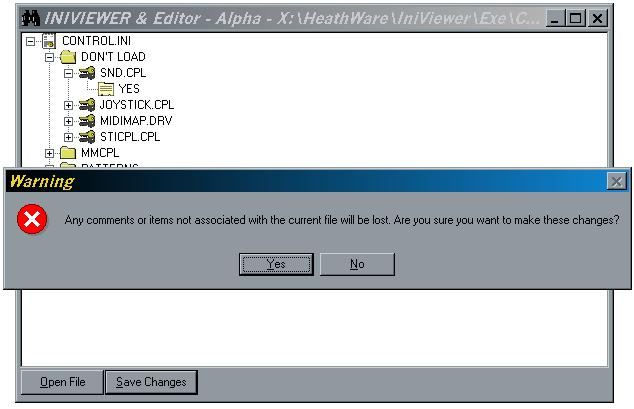



## IniEditor\[TreeNode Style\]

### Description

Updated from IniViewer. This code opens ini files and places its contents in a tree node. You can edit, delete, or insert new Sections/Keys/Values with this. I will make changes to this if it is needed. Please let me know what you think of it. I would also appreciate any votes you could give me.

* One thing to note is that this editor will only make changes to Sections/Keys/Values. If there are any comments in the ini file, they will be lost on saving. I might add some code to look for comments or any other bogus stuff in the file later on. Let me know if you think it is needed.
 
### More Info
 

             |
---                |---
**Submitted On**   |2000-10-18 01:14:46
**By**             |[Michael Heath](https://github.com/Planet-Source-Code/PSCIndex/blob/master/ByAuthor/michael-heath.md)
**Level**          |Intermediate
**User Rating**    |4.3 (17 globes from 4 users)
**Compatibility**  |VB 5\.0, VB 6\.0
**Category**       |[Complete Applications](https://github.com/Planet-Source-Code/PSCIndex/blob/master/ByCategory/complete-applications__1-27.md)
**World**          |[Visual Basic](https://github.com/Planet-Source-Code/PSCIndex/blob/master/ByWorld/visual-basic.md)
**Archive File**   |[CODE\_UPLOAD1078910192000\.zip](https://github.com/Planet-Source-Code/michael-heath-inieditor-treenode-style__1-12156/archive/master.zip)

